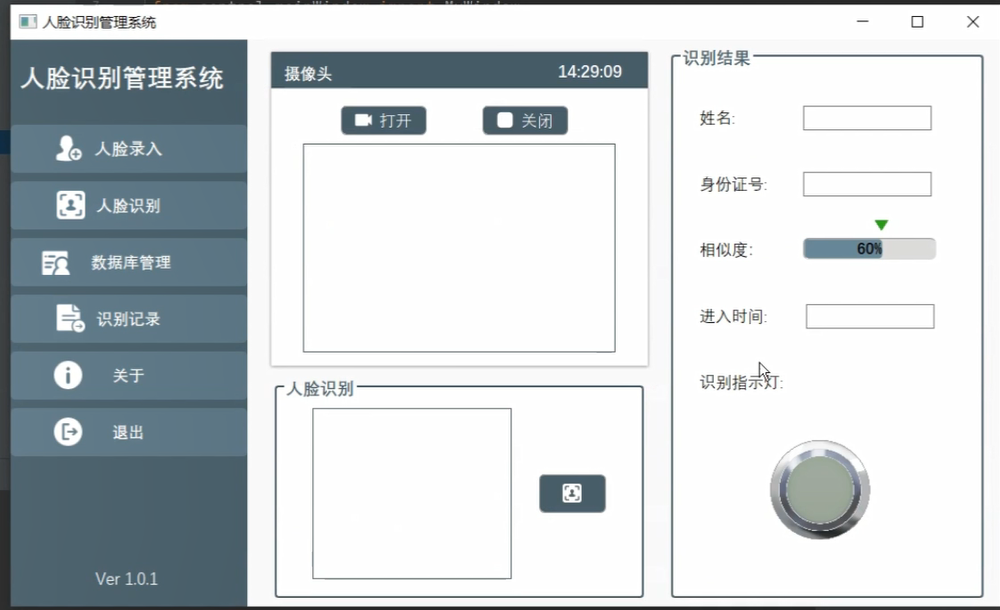

# AdaFace_gui: 基于AdaFace设计的gui界面


### 1. 去百度网盘下载数据集和预训练模型
[百度网盘地址]
(通过网盘分享的文件：adaface_gui资源下载
链接: https://pan.baidu.com/s/1sJbamow3CPABssmb2-9n7A 提取码: ktkt)

### 2. 配置conda环境(windows环境下)
```
conda create --name adaface_gui python=3.8.20
conda activate adaface_gui

pip install torch==2.1.0  -f https://mirrors.aliyun.com/pytorch-wheels/cu121
pip install torchvision==0.16.0 -f https://mirrors.aliyun.com/pytorch-wheels/cu121
(网速有点慢，试试在浏览器下载)
    https://mirrors.aliyun.com/pytorch-wheels/cu121/torch-2.1.0%2Bcu121-cp38-cp38-win_amd64.whl
    https://mirrors.aliyun.com/pytorch-wheels/cu121/torchvision-0.16.0%2Bcu121-cp38-cp38-win_amd64.whl
    下载好之后 
    pip install torch-2.1.0+cu121-cp38-cp38-win_amd64.whl torchvision-0.16.0+cu121-cp38-cp38-win_amd64.whl
测试torch_gpu是否可用
```python
    import torch

    # 检查GPU是否可用
    if torch.cuda.is_available():
        print("GPU可用！")
    else:
        print("GPU不可用，将使用CPU进行计算。")

pip install -r requirements.txt
```
#### 2.1 adaface模型推理测试
python inference.py

运行结果：(这是正确的)
```
tensor([[ 1.0000,  0.7456, -0.0823],
        [ 0.7456,  1.0000, -0.0066],
        [-0.0823, -0.0066,  1.0000]], grad_fn=<MmBackward0>)
```
# 运行core_code中的代码
## 1. get_face_feature.py 得到.pkl文件
## 2. face_recognize.py 得到人脸识别结果
    ```
    name 相似度 脸部边框（方便后面画框使用）
    检测器检测结果 [['赵丽颖', 0.5183316469192505, [227.36234743148088, 147.8600640743971, 343.5388028770685, 303.01372043043375, 0.9996910095214844]]]
    ```
## 3. gui界面
    ```
    gui界面是使用pyside6写成的
    ```
# 运行短视频


